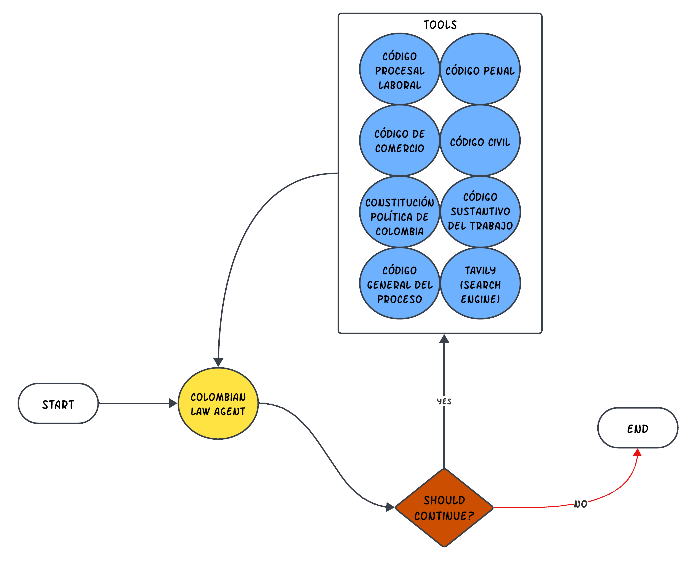

# Colombian Law Agent


The Colombian Law Agent is an agentic tool designed to simplify the way we interact with legal documents and laws in Colombia. At its core, this project is about making law accessible. Using web scraping techniques, I've gathered up-to-date information straight from official sources, because sometimes the latest laws aren’t available in a convenient format.

With the power of vector databases and AI, the Colombian Law Agent can quickly find and retrieve the exact legal information you need. Imagine asking a question about a specific law and getting a precise answer in seconds – that’s what this tool does. It’s built for everyone, from legal professionals to everyday citizens, ensuring that understanding Colombian law is as easy as asking a question.

The Colombian Law Agent has access to the following sources:
- Constitución Política de la República de Colombia
- Código Penal - LEY 599 DE 2000
- Código General del Proceso - LEY 1564 DE 2012
- Código Civil - LEY 84 DE 1873
- Código Sustantivo del Trabajo
- Codigo Procesal Laboral
- Código de Comercio
- Tavily Search Engine ~ In case it needs to access extra information.

The app isn’t just smart; it’s also user-friendly. A straightforward UI means you don’t need to be a tech wizard to use it. Whether you’re doing in-depth legal research or just curious about a law, the Colombian Law Agent may be your go-to resource, streamlining legal inquiries with technology.



| Colombia Law Agent Components | Link | Want to test it? |
| --------- | ---- | -------------- |
| 💻 Endpoint | https://jjovalle99--colombian-law-agent-serve.modal.run/agent/ | ```langserve.RemoteRunnable("https://jjovalle99--colombian-law-agent-serve.modal.run/agent/")``` |
| 📈 UI | https://jjovalle99--ui-colombia-law-agent-run.modal.run/ | Go to the link and play with the examples, or use one of your own. | 

*Please note: The app and UI will remain accessible until my OpenAI or Modal credits are depleted.*

## Stages

### Data Collection & Preparation
Since there were no updated PDFs available for the law sources of interest, I needed to scrape the information from the original sources. For this scraping process, I used Browserless, which was essential for accessing content that only appeared after interactive elements were triggered. This approach was crucial for capturing additional relevant information. Once the HTML files were obtained, I utilized BeautifulSoup to extract and retain only the pertinent text from the HTML documents. Subsequently, DVC, with an S3 bucket set as a remote storage, was employed for version control of the data. Interested in the code? See [scraper.py](https://github.com/jjovalle99/colombian-law-agent/blob/071573b467ea7c22b5a6c5e5f4c9a1e81fdcd2c9/scripts/scraper.py), [html-to-txt.py](https://github.com/jjovalle99/colombian-law-agent/blob/071573b467ea7c22b5a6c5e5f4c9a1e81fdcd2c9/scripts/html-to-txt.py) and [generate_metadata.py](https://github.com/jjovalle99/colombian-law-agent/blob/071573b467ea7c22b5a6c5e5f4c9a1e81fdcd2c9/scripts/generate_metadata.py).

### Retrievers (RAGs)
For the retrievers, I employed Qdrant to host a database where the information from each relevant law source was stored in distinct collections. This structure facilitated the creation of a suite of retrievers, each specialized in a different data source. To enhance the retrieval process, I integrated the Cohere Multilingual Reranker with each retriever to improve the results. Once the retriever-reranker setup was finalized, they were adapted into OpenAI functions using LangChain, making them ready for the Agent. Additionally, a Tavily search engine tool was added to the toolkit to address scenarios where the retrievers were insufficient. Interested in the code? See [create_qdrant_collections.py](https://github.com/jjovalle99/colombian-law-agent/blob/071573b467ea7c22b5a6c5e5f4c9a1e81fdcd2c9/scripts/create_qdrant_collections.py).

### App Building
The app-building process began with drafting the entire workflow in a Jupyter Notebook. I developed different types of agents using a combination of LangChain, LangSmith, and Langgraph:
- One-direction Agent
- Cyclic Agent
- Cyclic AgentExecutor (i.e., enabling chat history)

Subsequently, I performed a quick local deployment of the last Agent type mentioned using LangServe to verify if the endpoint would exhibit the expected behavior. Interested in the code? See [app_draft.ipynb](https://github.com/jjovalle99/colombian-law-agent/blob/071573b467ea7c22b5a6c5e5f4c9a1e81fdcd2c9/app_draft.ipynb).

*Note: `gpt-4-turbo-preview` and `text-embedding-3-large` were used as the LLM and embedding model respectively*

### UI
I constructed a basic UI for the endpoint using Streamlit. This UI facilitates simple calls without chat history. However, the Agent endpoint is designed to support chat history for those interested in utilizing it. Interested in the code? See [UI folder](https://github.com/jjovalle99/colombian-law-agent/tree/071573b467ea7c22b5a6c5e5f4c9a1e81fdcd2c9/ui)

### Deployment
I adopted a microservices architecture for the deployment, wherein the UI and the Agent endpoint were deployed independently. These deployments were serverless, executed through the convenient Modal Python package, eliminating the need for Dockerfiles or direct interaction with cloud providers. Interested in the code? See [Agent Endpoint Folder](https://github.com/jjovalle99/colombian-law-agent/tree/071573b467ea7c22b5a6c5e5f4c9a1e81fdcd2c9/app) and [UI folder](https://github.com/jjovalle99/colombian-law-agent/tree/071573b467ea7c22b5a6c5e5f4c9a1e81fdcd2c9/ui)

## Tech Stack

The following technologies were utilized to build this app:

| Component                      | Stack                                               |
| ------------------------------ | --------------------------------------------------- |
| Data Collection & Preparation  | Browserless, BeautifulSoup, DVC, Amazon S3          |
| Retrievers (RAGs)              | Qdrant Vector Database, Cohere Reranker             |
| App Building                   | LangChain, LangSmith, LangGraph, LangServe, Tavily  |
| UI                             | Streamlit                                           |
| Deployment                     | Modal                                               |


## Scripts

## How to deploy the app?
```bash
modal deploy app/app.py
```

## How to deploy the UI?
```bash
modal deploy ui/serve_streamlit.py
```

## How to create and populate Qdrant collections?
```bash
python scripts/create_qdrant_collections.py \
    --collection_name "constitucion" \
    --folder "data/constitucion/text/" \
    --doc_name "Constitución Política de la República de Colombia" \
    --llm "gpt-4-turbo-preview" \
    --embedding_model "text-embedding-3-large" 

python scripts/create_qdrant_collections.py \
    --collection_name "codigo_penal" \
    --folder "data/codigo_penal/text/" \
    --doc_name "Código Penal - LEY 599 DE 2000" \
    --llm "gpt-4-turbo-preview" \
    --embedding_model "text-embedding-3-large" 

python scripts/create_qdrant_collections.py \
    --collection_name "codigo_general_del_proceso" \
    --folder "data/codigo_general_del_proceso/text/" \
    --doc_name "Código General del Proceso - LEY 1564 DE 2012" \
    --llm "gpt-4-turbo-preview" \
    --embedding_model "text-embedding-3-large" 

python scripts/create_qdrant_collections.py \
    --collection_name "codigo_civil" \
    --folder "data/codigo_civil/text/" \
    --doc_name "Código Civil - LEY 84 DE 1873" \
    --llm "gpt-4-turbo-preview" \
    --embedding_model "text-embedding-3-large" 

python scripts/create_qdrant_collections.py \
    --collection_name "codigo_sustantivo_trabajo" \
    --folder "data/codigo_sustantivo_trabajo/text/" \
    --doc_name "Código Sustantivo del Trabajo" \
    --llm "gpt-4-turbo-preview" \
    --embedding_model "text-embedding-3-large"

python scripts/create_qdrant_collections.py \
    --collection_name "codigo_procedimental_laboral" \
    --folder "data/codigo_procedimental_laboral/text/" \
    --doc_name "Codigo Procesal Laboral" \
    --llm "gpt-4-turbo-preview" \
    --embedding_model "text-embedding-3-large" 

python scripts/create_qdrant_collections.py \
    --collection_name "codigo_comercio" \
    --folder "data/codigo_comercio/text/" \
    --doc_name "Código de Comercio" \
    --llm "gpt-4-turbo-preview" \
    --embedding_model "text-embedding-3-large" 
```

# How to collect and prepare data?
See [data folder](https://github.com/jjovalle99/colombian-law-agent/tree/071573b467ea7c22b5a6c5e5f4c9a1e81fdcd2c9/data) for the entire script calls.